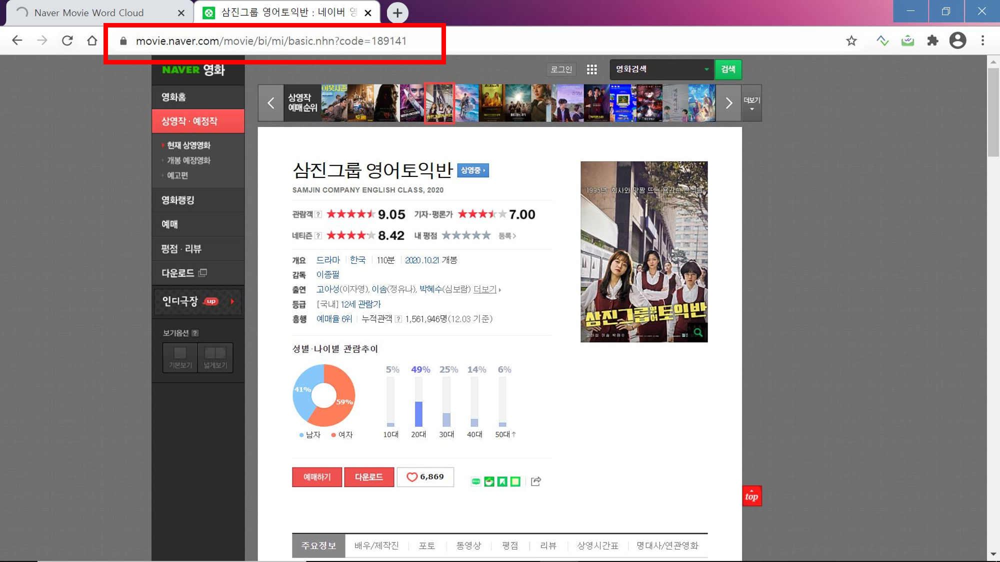
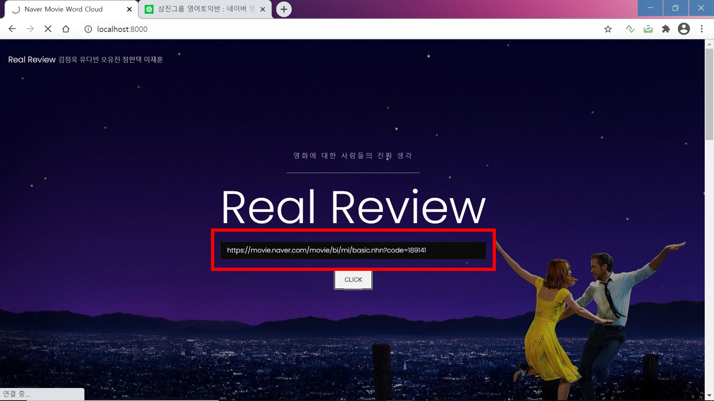
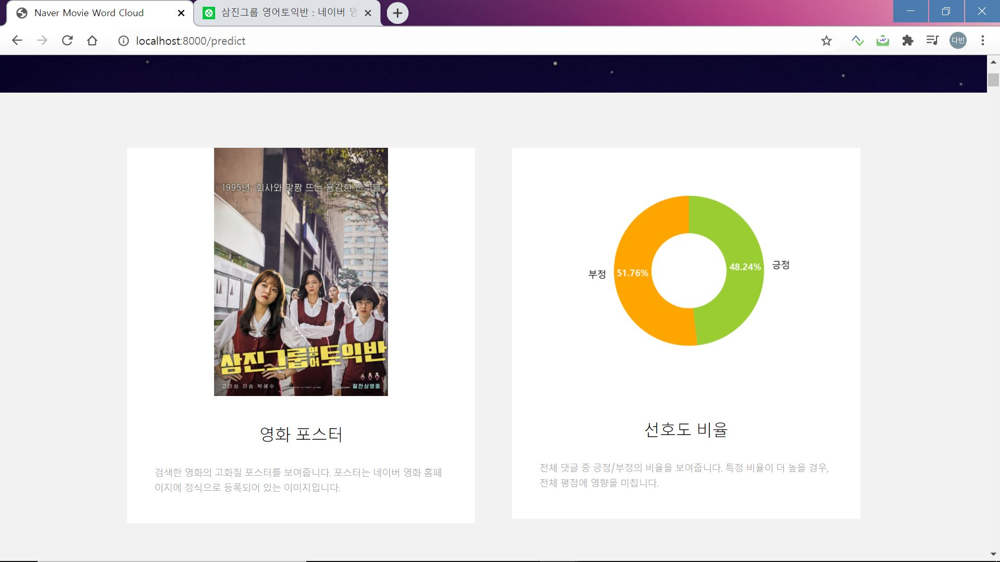
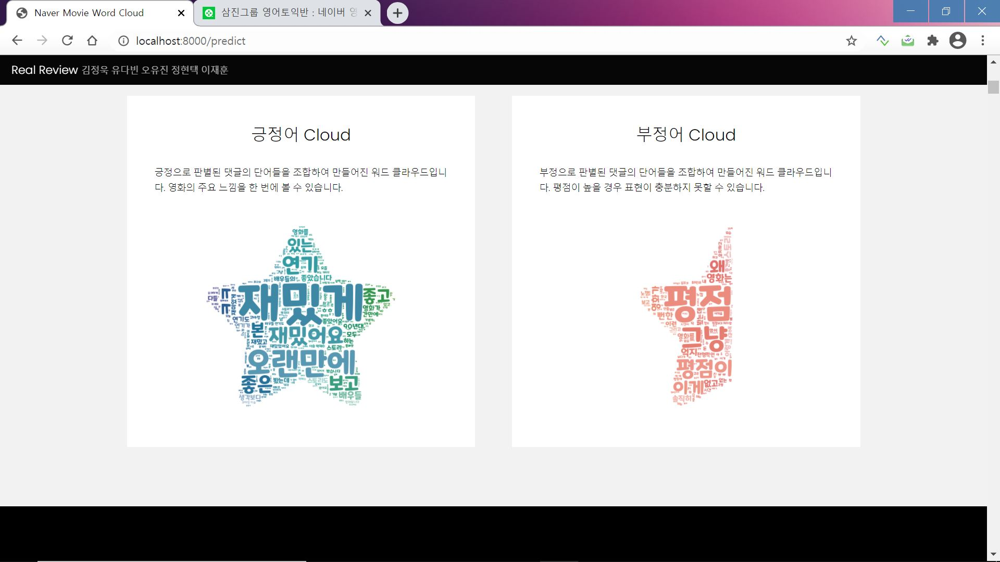
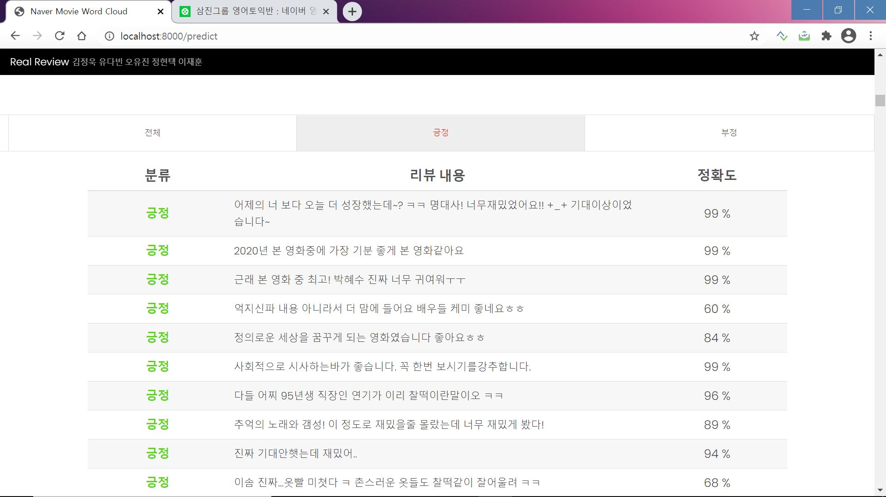

# [네이버 영화 리뷰 감성 분석 플랫폼] :speech_balloon:
파이썬을 활용한 네이버 영화 리뷰 긍정/부정 예측 서비스

## 1. 데이터 수집
* 크롤링을 통해 긍정 리뷰 25만 개, 부정 리뷰 25만 개 총 50만 개의 리뷰 데이터 수집

## 2. 데이터 전처리
* 한글 데이터만 남기기
* 토큰화 적용, 불용어 제거
* 정수 인코딩
* 패딩

## 3. LSTM 모델로 학습, 예측
* epochs와 batch_size를 조절하면서 모델링한 결과 적절한 모델을 결정

## 4. 결과

:point_right: [네이버 영화 사이트](https://movie.naver.com/movie/bi/mi/basic.nhn?code=189141) 에서 url 복사

:point_right: 플랫폼 url 검색창에 붙여넣기

:point_right: 해당 url에 대한 영화 포스터와 리뷰 크롤링 수행 후 시각화 

:point_right: 영화 리뷰에 대해 긍정과 부정을 stylecloud로 시각화

:point_right: 영화 리뷰에 대해 긍정과 부정 예측 결과 시각화
